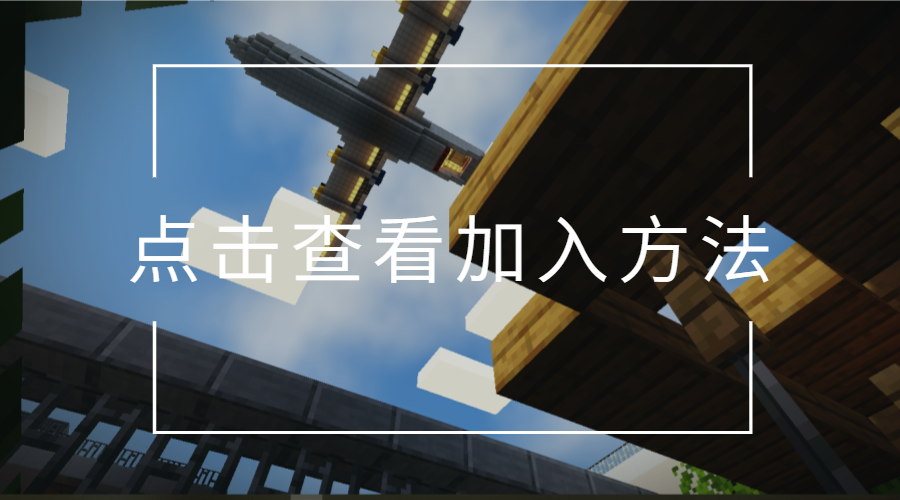

# 欢迎来到FuHyMC Minecraft社区

<!-- !> 此文档正在修改中，因此我们建议您直接加入我们的QQ群1079084078寻求登录方法而非阅读此文档。 -->
> FuHyMC允许正版登录或者使用LittleSkin外置登录，使用Minecraft Java版1.20.4游玩服务器。

<!--!> > 购买了Minecraft：Java 版和 Bedrock 版的Minecraft正版用户还可实现基岩版与Java版账户信息互通（既角色信息共用，包括背包数据，玩家位置，身份组等）。[详情请见此处](geyser-data-interchange)-->

<!--!>!> 对于**仅**拥有基岩版Minecraft，且并不打算在电脑上进行游玩本服务器的玩家，请直接在基岩版中进入服务器，无需根据下方操作进行注册。地址为`entrance.fuhymc.cn`，端口为`19132`。但如果您需要进行Java版与基岩版的数据互通，请完成下列步骤并成功通过Java版进入服务器后[转到这里](geyser-data-interchange.md)以查看互通配置教程。-->

## 简介

服务器版本：**Minecraft国际版** `1.20.4`

**服务器地址：`play.fuhymc.cn`**

<!-- 备用地址：`play.fuhymc.cn:25565` \(上面那个加不进去就用这个\) -->

玩法：
双服务器：
- 粘液科技
- 高版本纯净生存

本服特色：
- 使用[LittleSkin](https://littleskin.cn/)外置登录，皮肤可见。

QQ群：[点击这里或搜索群号1079084078加入](https://jq.qq.com/?_wv=1027&k=bw6B6MKN)

## 准备好了吗，那就

