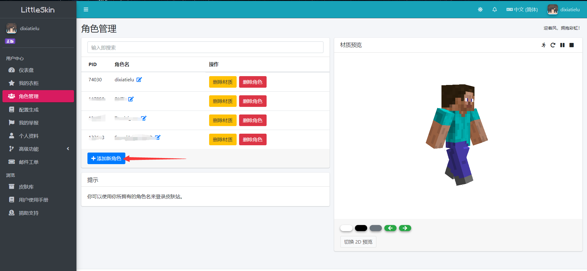

# 加入步骤

## 注册账号

[点击这里进入LittleSkin官网](https://littleskin.cn/)注册账号

[点击这里进入LittleSkin官网](https://littleskin.cn/)注册账号

[点击这里进入LittleSkin官网](https://littleskin.cn/)注册账号

\(若您拥有正版Minecraft，可以无需注册直接点击登录并使用正版注册邮箱和密码在LittleSkin登录\)

!> 这里的“正版账户直接登录”并非指在启动器登录，您仍需在LittleSkin网站使用您的正版邮箱与密码登录一次并完成后续步骤。使用正版账户登陆LittleSkin后相当于已为LittleSkin账号绑定正版账户。

你也可以选择使用MCBBS账号或者Microsoft Live（微软账号）登录。

## LittleSkin的基本使用

* 打开注册时你所使用的邮箱，找到LittleSkin发送的邮箱验证邮件并点击按钮验证你的邮箱。

* 如图所示，在网页侧边栏中**创建一个角色**，这个角色的名字即为你的游戏名。

  

  

!> 请务必在启动游戏前在LittleSkin内至少创建一个角色，否则后续游戏无法启动！

* 如果你希望你在游戏中的角色不是Steve，请在皮肤库选择你喜欢的皮肤，或者上传新皮肤，并把你的皮肤应用到你创建的角色上。

可以访问LittleSkin配有的[官方用户手册](https://manual.littlesk.in/)获取更多使用方法。

## 安装Java
如果您的电脑上没有安装Java，或者打开启动器、启动游戏时出现要求安装Java的提示框，请根据启动器提示安装Java或在网络上自行下载安装Java17 JDK。

## 运行、配置启动器
您可以使用您熟悉的Minecraft启动器安装Minecraft 1.19.3，并将LittleSkin主页上`快速配置启动器`的`将此按钮拖动至启动器`按钮拖进启动器内以快速设置外置登陆地址。

若您的启动器无法以此种方式快速设置，请[浏览LittleSkin提供的外置登陆帮助文档](https://manual.littlesk.in/advanced/yggdrasil.html#%E5%9C%A8%E5%AE%A2%E6%88%B7%E7%AB%AF%E4%BD%BF%E7%94%A8)。

我们推荐您使用BakaXL、HMCL或PCl2启动器启动Minecraft。

对于BakaXL启动器，您可以[观看此教程视频](https://www.bilibili.com/video/BV1W741197Bv)获取设置外置登陆的方法。

## 进入服务器
   点击"多人游戏"，选择进入上方服务器，地址为 **`play.fuhymc.cn`**

   如果上面地址无法加入，请使用下方地址为`entrance.fuhymc.cn:25565`的服务器
   

   至此，你已经成功进入FuHyMC服务器，现在，就快乐游玩吧！
## 遇到问题怎么办？

[请先点击这里查阅常见问题指南](fu-wu-qi-wan-fa/faq.md)

!> 如果您遇到任何问题，请加入我们的QQ群：`1079084078`询问，群友们可为您提供力所能及的帮助。在提问之前请保证您完整、仔细阅读本文档。